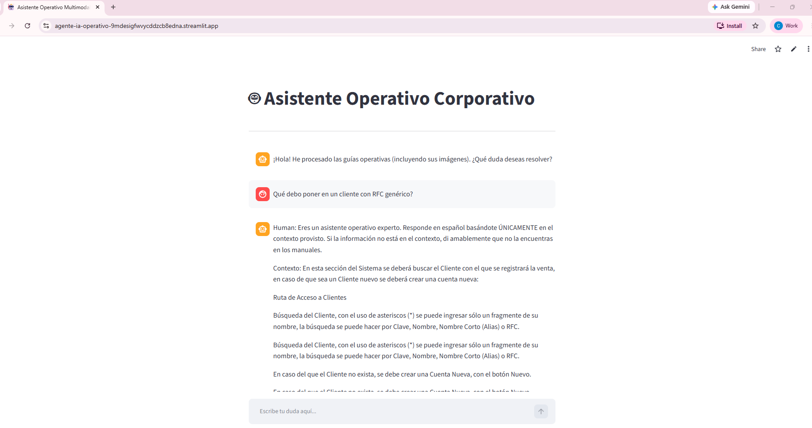

# 🤖 Agente IA RAG Multimodal: Consultor de Guías Operativas

Este proyecto implementa un sistema **RAG (Generación Aumentada por Recuperación) Multimodal** corporativo que permite a los usuarios interactuar mediante lenguaje natural con guías operativas y manuales en formato Word (`.docx`), **incluyendo la interpretación de sus imágenes y diagramas integrados**.

La aplicación está completamente desplegada en la nube y es accesible de manera global y segura.

🌐 **Enlace a la Aplicación en Producción:** [Acceder al Agente IA en Streamlit Cloud](https://agente-ia-operativo-9mdesigfwvycddzcb8edna.streamlit.app/)

---

## 📸 Demostración de Caso de Uso

A continuación se muestra la interfaz interactiva en producción donde el usuario final puede resolver dudas operativas sobre procesos y elementos visuales de los manuales en tiempo real:



*El agente recupera los fragmentos de los manuales y las descripciones de imágenes más cercanos a la duda del usuario, los analiza y redacta una respuesta estructurada en español.*

---

## 🏗️ Arquitectura de Despliegue (Híbrida & Eficiente)

Para garantizar la estabilidad en entornos de servidores web con recursos limitados (Capa gratuita de Streamlit Cloud), el proyecto utiliza una **arquitectura híbrida de dos fases**:

```mermaid
graph TD
    subgraph Entorno Local (Computadora del Desarrollador)
        A[Manuales .docx con imágenes] --> B[Script: ingestar_multimodal.py]
        B --> C[Modelo Visión: BLIP Salesforce]
        C --> D[Generación de descripciones de imágenes]
        D --> E[Base de Datos Vectorial Chroma DB local]
    end
    subgraph Servidor en la Nube (Streamlit Cloud)
        E -->|Subida via GitHub| F[Carpeta ./vector_db]
        F --> G[app.py Ultra-Ligero]
        H[Modelo Texto: Qwen2.5-0.5B] --> G
        G --> I[URL Pública / Interfaz de Chat]
    end